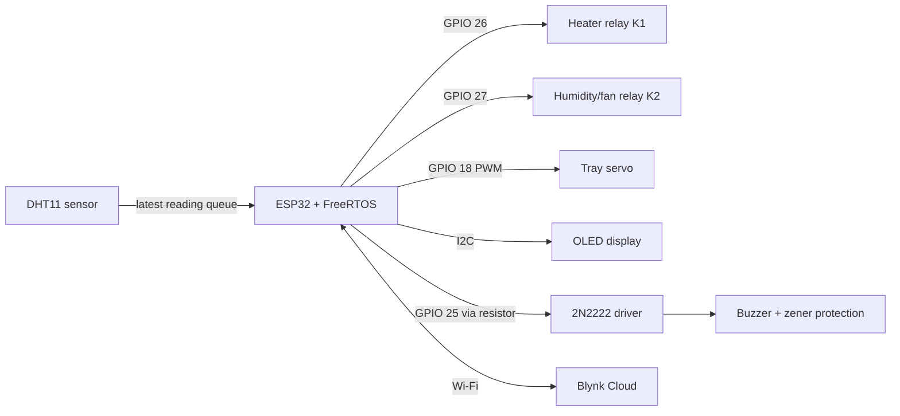

# Smart Egg Incubator

An ESP32-based poultry incubator that uses FreeRTOS tasks for environmental sensing, closed-loop temperature and humidity control, scheduled egg turning, safety monitoring, local status display, and Blynk remote monitoring.

The implementation follows the Birzeit University ENCS5140 project brief. Local control remains independent of Wi-Fi so a network outage does not stop the incubator.

> [!WARNING]
> This project controls a heating element. Use a correctly rated relay or SSR, a separately rated power supply, an inline fuse, and an independent thermal cutoff. Do not connect mains voltage on a breadboard. The load-side schematic is intentionally marked as provisional until the exact hardware ratings are confirmed.

## Features

- Reads temperature and humidity from a DHT11 every second.
- Maintains 37.2-37.8 °C with hysteresis control.
- Maintains 50-55% RH during setting and 65-70% RH during lockdown.
- Turns the egg tray every four hours and stops turning on day 18.
- Shows temperature, humidity, day, actuator state, and operating mode on a 128x64 OLED.
- Publishes telemetry and accepts manual test commands through Blynk.
- Forces both relays off for missing, invalid, stale, or dangerously hot sensor data.
- Runs the safety watchdog at the highest task priority.
- Continues sensing, control, display, and alarms without Wi-Fi.

## System architecture



The complete project requirements are preserved in the [original project brief](docs/project-brief.pdf).

## Hardware pinout

| ESP32 connection | Peripheral | Function |
| --- | --- | --- |
| GPIO 4 | DHT11 data | Temperature and humidity |
| GPIO 18 | Servo signal | Egg-tray position; powered from the buck converter's 5 V output |
| GPIO 21 | OLED SDA | I2C data |
| GPIO 22 | OLED SCL | I2C clock |
| GPIO 25 | 1 kΩ resistor -> 2N2222 | 5 V buzzer driver with zener protection |
| GPIO 26 | Relay K1 input | Heater control, active-low |
| GPIO 27 | Relay K2 input | Humidity/fan control, active-low |

See the [wiring guide](docs/WIRING.md) and [draft schematic](docs/wiring-diagram.svg) before assembling the circuit.

## Power topology

The 12 V source powers the relay board and the input of a buck converter. The buck converter supplies regulated 5 V to the tray servo. Relay K1 switches the 12 V heater circuit and relay K2 switches the 12 V fan circuit. The buzzer receives 5 V from the ESP32 and is controlled from GPIO 25 through a 1 kΩ resistor and 2N2222 transistor, with zener protection.

Exact relay terminals and load ratings are tracked in the wiring guide.

## FreeRTOS design

| Task | Core | Priority | Period / trigger | Responsibility |
| --- | ---: | ---: | --- | --- |
| `SensorReadTask` | 1 | 3 | 1 s | Read the DHT11 and overwrite the latest-reading queue |
| `HeaterCtrlTask` | 1 | 3 | 1 s | Apply temperature hysteresis and fail-safe output control |
| `HumidityCtrlTask` | 1 | 2 | 2 s | Apply the active-stage humidity band |
| `EggTurnTask` | 1 | 2 | Task notification | Move the tray while holding the motor mutex |
| `SafetyWatchdogTask` | 1 | 4 | 500 ms | Detect sensor and over-temperature faults |
| `DisplayTask` | 1 | 1 | 1 s | Render local status while holding the display mutex |
| `DayCounterTask` | 1 | 1 | 60 s | Track the current day and enter lockdown |
| `BlynkSyncTask` | 0 | 2 | 10 ms loop / 2 s publish | Reconnect Wi-Fi/Blynk and exchange dashboard data |

`sensorQueue` is a one-item latest-value mailbox. The software timer wakes the egg-turn task every four hours, while mutexes serialize display and servo access.

## Blynk dashboard

Create these virtual datastreams in the Blynk template:

| Virtual pin | Direction | Suggested widget | Value |
| --- | --- | --- | --- |
| V0 | Device -> cloud | Gauge | Temperature in °C |
| V1 | Device -> cloud | Gauge | Relative humidity in % |
| V2 | Device -> cloud | LED | Heater state |
| V3 | Device -> cloud | LED | Humidity/fan state |
| V4 | Device -> cloud | LED | Egg-turn activity |
| V5 | Device -> cloud | Labeled value | Incubation day |
| V6 | Cloud -> device | Switch | Automatic/manual mode |
| V7 | Cloud -> device | Slider, 35-40 | Manual temperature setpoint |
| V8 | Cloud -> device | Push button | Manual egg turn |
| V9 | Device -> cloud | String display | `OK` or `ALARM` |
| V10 | Cloud -> device | Switch | Manual heater request |
| V11 | Cloud -> device | Switch | Manual fan request |

Manual heater and fan commands are accepted only in manual mode and remain blocked by the local safety state.

## Build and upload

### Arduino IDE

1. Install the ESP32 board package.
2. Install `Blynk`, `DHT sensor library`, `Adafruit GFX Library`, `Adafruit SSD1306`, and `ESP32Servo` from Library Manager.
3. Copy `SmartIncubator/Secrets.h.example` to `SmartIncubator/Secrets.h`.
4. Enter the Blynk template/device credentials and a 2.4 GHz Wi-Fi network in `Secrets.h`.
5. Open `SmartIncubator/SmartIncubator.ino`.
6. Select the matching ESP32 board and serial port, then upload.

### Arduino CLI

```bash
cp SmartIncubator/Secrets.h.example SmartIncubator/Secrets.h
# Edit SmartIncubator/Secrets.h, then compile:
arduino-cli compile --fqbn esp32:esp32:esp32 SmartIncubator
```

`Secrets.h` is ignored by Git. Never commit Wi-Fi passwords or Blynk device tokens.

## Configuration

All pins, setpoints, timing constants, servo positions, and feature switches live in `SmartIncubator/Config.h`.

The current tested configuration has heater output enabled and the two-minute range alarm disabled. Immediate sensor and over-temperature faults are always active. Enable the range alarm only when bench conditions are expected to reach incubation setpoints; otherwise a room-temperature test will intentionally alarm after two minutes.

## Repository layout

```text
.
├── SmartIncubator/
│   ├── SmartIncubator.ino   # Entry point, shared state, setup
│   ├── Config.h             # Pins, setpoints, and timing
│   ├── Control.ino          # Actuator and control helpers
│   ├── Tasks.ino            # FreeRTOS task implementations
│   ├── BlynkHandlers.ino    # Dashboard command handlers
│   └── Secrets.h.example    # Safe credential template
├── docs/
│   ├── project-brief.pdf
│   ├── WIRING.md
│   └── wiring-diagram.svg
└── README.md
```

## Known limitations

- The day counter is based on uptime and resets to day 1 after a reboot. A DS3231 RTC or persisted start timestamp is needed for power-loss recovery.
- No tray limit switch is installed or handled in the current firmware; the turn action relies on fixed servo positions and a two-second settle time.
- The code reports alarm state on V9 but does not yet call a Blynk event for push notifications.
- The current sensor is configured as DHT11, while the project brief recommends DHT22 or SHT31 for better accuracy.
- `SERVO_POSITION_B` is preserved at `260` from the tested sketch. Confirm that this value is correct for the installed servo before changing it.
- The final load-side wiring depends on the actual relay board, actuator voltages, current ratings, and power supplies.

## Safety checklist

- Verify relay/SSR voltage and current ratings against each load.
- Keep high-current load wiring physically separate from ESP32 signal wiring.
- Power the servo from a supply sized for its stall current; do not assume the ESP32 regulator is sufficient.
- Install a fuse and independent thermal cutoff in series with the heater.
- Confirm whether the relay module requires a 5 V logic supply, a separate `JD-VCC`, or 3.3 V-compatible inputs.
- Test fail-safe startup and sensor-disconnect behavior before installing eggs.

No license has been selected for this academic project. Add one before redistributing the code if you want to grant reuse rights.
