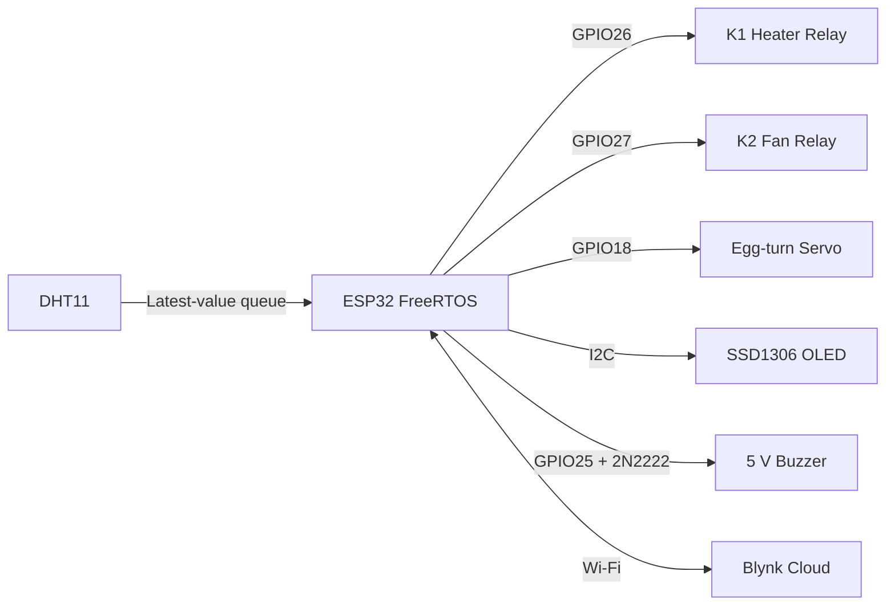

# Smart Egg Incubator

An ESP32-based poultry incubator built with FreeRTOS, local environmental control, automatic egg turning, an OLED status display, safety monitoring, and Blynk remote supervision.

The firmware follows the Birzeit University ENCS5140 project requirements while keeping all essential control functions independent of Wi-Fi.

## Final schematic


Open the [full-size SVG schematic](docs/wiring-diagram.svg) for printing or detailed inspection. The original course specification is available in [docs/project-brief.pdf](docs/project-brief.pdf).

## System functions

- Reads temperature and humidity from a DHT11 every second.
- Maintains 37.2-37.8 °C using an active-low heater relay.
- Maintains 50-55% relative humidity during setting and 65-70% during lockdown.
- Turns the egg tray every four hours and stops automatic turning on day 18.
- Shows temperature, humidity, incubation day, actuator states, and operating mode on a 128x64 OLED.
- Publishes telemetry to Blynk every two seconds.
- Provides Blynk manual controls for the heater, fan, temperature setpoint, and egg turn.
- Turns the heater and fan off on invalid, stale, or unsafe sensor readings.
- Continues local control, display, turning, and alarms without Wi-Fi.

## Hardware

| Reference | Component | Purpose |
| --- | --- | --- |
| U1 | ESP32 DevKit V1 | Controller, FreeRTOS, Wi-Fi, and Blynk |
| U2 | 12 V to 5 V buck converter | Supplies regulated 5 V to the servo |
| U3 | Two-channel 12 V active-low relay module | Switches the heater and fan |
| TH1 | DHT11 | Temperature and humidity sensing |
| DS1 | SSD1306 128x64 I2C OLED | Local status display |
| M1 | 5 V servo | Egg-tray positioning |
| M2 | 12 V fan | Air circulation and humidity control |
| H1 | 12 V heater | Incubator heating element |
| BZ1 | 5 V buzzer | Local audible alarm |
| Q1 | 2N2222 NPN transistor | Buzzer driver |
| R1 | 1 kΩ resistor | Limits GPIO25 base current |
| D1 | Zener diode | Buzzer-driver protection |
| J1 | 12 V DC source | Relay, heater, fan, and buck-converter supply |

## Electrical connections

### ESP32 pinout

| ESP32 pin | Connection | Function |
| --- | --- | --- |
| GPIO 4 | DHT11 data | Temperature and humidity input |
| GPIO 18 | Servo signal | Egg-tray movement |
| GPIO 21 | OLED SDA | I2C data |
| GPIO 22 | OLED SCL | I2C clock |
| GPIO 25 | R1, then Q1 base | Buzzer control |
| GPIO 26 | Relay IN1 / K1 | Heater control, active-low |
| GPIO 27 | Relay IN2 / K2 | Fan control, active-low |
| 3.3 V | DHT11 and OLED VCC | Sensor/display power |
| 5 V / VIN | Buzzer positive terminal | Buzzer power |
| GND | All low-voltage grounds | Common reference |

### 12 V power and relay wiring

The 12 V source is divided into the relay/load branch and the servo branch:

1. Connect `+12 V` to the relay module power input, relay K1 `COM`, relay K2 `COM`, and buck-converter `IN+`.
2. Connect the 12 V source negative terminal to the common ground and buck-converter `IN-`.
3. Connect relay K1 `NO` through the thermal cutoff to the heater positive terminal.
4. Connect the heater negative terminal to common ground.
5. Connect relay K2 `NO` to the 12 V fan positive terminal.
6. Connect the fan negative terminal to common ground.
7. Leave both relay `NC` contacts unused so the heater and fan remain off when their relays are inactive.

### Servo and buck converter

1. Connect the buck converter input to the 12 V source.
2. Set the buck output to 5 V before connecting the servo.
3. Connect buck `OUT+` to the servo positive wire.
4. Connect buck `OUT-` to the servo ground and common ground.
5. Connect the servo signal wire to ESP32 GPIO18.

### Buzzer driver

The buzzer uses a transistor driver instead of drawing its operating current directly from GPIO25:

1. Connect the ESP32 5 V pin to the buzzer positive terminal.
2. Connect the buzzer negative terminal to the 2N2222 collector.
3. Connect the 2N2222 emitter to ground.
4. Connect GPIO25 through the 1 kΩ resistor to the 2N2222 base.
5. Connect the zener across the buzzer as shown in the schematic.

### Sensor and OLED

- DHT11: `VCC -> 3.3 V`, `DATA -> GPIO4`, `GND -> GND`.
- OLED: `VCC -> 3.3 V`, `SDA -> GPIO21`, `SCL -> GPIO22`, `GND -> GND`.
- The OLED I2C address is `0x3C`.

## Software architecture



The sensor queue contains one `SensorData` value and is overwritten on every new reading. Control and monitoring tasks peek at the latest value without sharing raw sensor globals. The motor and display each use a mutex, and a FreeRTOS software timer notifies the egg-turn task every four hours.

## FreeRTOS tasks

| Task | Core | Priority | Period or trigger | Responsibility |
| --- | ---: | ---: | --- | --- |
| `SensorReadTask` | 1 | 3 | 1 second | Read DHT11 and publish the latest value |
| `HeaterCtrlTask` | 1 | 3 | 1 second | Temperature hysteresis and heater safety |
| `HumidityCtrlTask` | 1 | 2 | 2 seconds | Fan/humidity control for the active stage |
| `EggTurnTask` | 1 | 2 | Task notification | Alternate the tray position |
| `SafetyWatchdogTask` | 1 | 4 | 500 ms | Detect stale, invalid, and unsafe readings |
| `DisplayTask` | 1 | 1 | 1 second | Update the OLED |
| `DayCounterTask` | 1 | 1 | 60 seconds | Track incubation day and lockdown |
| `BlynkSyncTask` | 0 | 2 | 10 ms loop, 2-second publish | Maintain Wi-Fi/Blynk and dashboard data |

## Control behavior

### Temperature

The heater uses hysteresis control:

- Below 37.2 °C: heater on.
- Above 37.8 °C: heater off.
- Inside the band: preserve the current heater state.

### Humidity

- Days 1-17: fan/humidity range 50-55%.
- Days 18-21: lockdown range 65-70%.
- Below the active lower limit: humidity output on.
- Above the active upper limit: humidity output off.

### Egg turning

- The servo alternates between configured positions every four hours.
- Each movement is allowed two seconds to settle.
- Automatic and manual turning are disabled during lockdown.

### Safety watchdog

The 500 ms watchdog immediately disables both relays and activates the buzzer when a reading is missing, invalid, older than five seconds, outside the sensor's physical range, or above 42 °C.

The relays are initialized off before their GPIO pins are enabled. This provides a fail-safe startup state for the heater and fan.

## Blynk dashboard

| Virtual pin | Direction | Widget | Value |
| --- | --- | --- | --- |
| V0 | Device -> cloud | Gauge | Temperature in °C |
| V1 | Device -> cloud | Gauge | Relative humidity in % |
| V2 | Device -> cloud | LED | Heater state |
| V3 | Device -> cloud | LED | Fan state |
| V4 | Device -> cloud | LED | Egg-turn activity |
| V5 | Device -> cloud | Labeled value | Incubation day |
| V6 | Cloud -> device | Switch | Automatic/manual mode |
| V7 | Cloud -> device | Slider, 35-40 | Manual temperature setpoint |
| V8 | Cloud -> device | Push button | Manual egg turn |
| V9 | Device -> cloud | String display | `OK` or `ALARM` |
| V10 | Cloud -> device | Switch | Manual heater request |
| V11 | Cloud -> device | Switch | Manual fan request |

Entering or leaving manual mode turns both controlled outputs off. After a Blynk reconnect, manual heater and fan commands also return to off. All manual actuator commands remain subject to the local safety watchdog.

## Build and upload

### Required Arduino libraries

- Blynk
- DHT sensor library
- Adafruit GFX Library
- Adafruit SSD1306
- ESP32Servo

### Arduino IDE

1. Install the ESP32 board package and the required libraries.
2. Copy `SmartIncubator/Secrets.h.example` to `SmartIncubator/Secrets.h`.
3. Add the Blynk template ID, Blynk device token, and 2.4 GHz Wi-Fi credentials.
4. Open `SmartIncubator/SmartIncubator.ino`.
5. Select the ESP32 board and serial port.
6. Compile and upload.

### Arduino CLI

```bash
cp SmartIncubator/Secrets.h.example SmartIncubator/Secrets.h
# Edit Secrets.h, then compile:
arduino-cli compile --fqbn esp32:esp32:esp32 SmartIncubator
```

`SmartIncubator/Secrets.h` is excluded by `.gitignore` and must never be committed.

## Configuration

All hardware pins, setpoints, servo positions, alarm switches, and timing values are centralized in `SmartIncubator/Config.h`.

| Setting | Current value |
| --- | --- |
| Sensor | DHT11 |
| Temperature band | 37.2-37.8 °C |
| Setting humidity | 50-55% |
| Lockdown humidity | 65-70% |
| Total incubation | 21 days |
| Lockdown starts | Day 18 |
| Egg-turn interval | 4 hours |
| Servo positions | 0 and 260 |
| Sensor period | 1 second |
| Safety period | 500 ms |
| Blynk publish period | 2 seconds |
| Range-alarm grace period | 2 minutes |

## Repository structure

```text
.
├── SmartIncubator/
│   ├── SmartIncubator.ino   # Entry point, shared state, setup
│   ├── Config.h             # Pins, setpoints, and timing
│   ├── Control.ino          # Actuator and control helpers
│   ├── Tasks.ino            # FreeRTOS task implementations
│   ├── BlynkHandlers.ino    # Dashboard command handlers
│   └── Secrets.h.example    # Credential template
├── docs/
│   ├── project-brief.pdf    # Original course specification
│   └── wiring-diagram.svg   # Final electronic schematic
├── .gitignore
└── README.md
```

## Electrical safety

- Keep the 12 V heater/fan wiring separate from ESP32 signal wiring.
- Use wiring and relay contacts rated for the heater and fan current.
- Keep the thermal cutoff in series with the heater.
- Verify the buck output is 5 V before connecting the servo.
- Use a common ground for the ESP32, buck converter, servo, relay inputs, buzzer driver, and 12 V supply negative.
- Test relay fail-safe startup and sensor-disconnect behavior before operating the incubator unattended.
