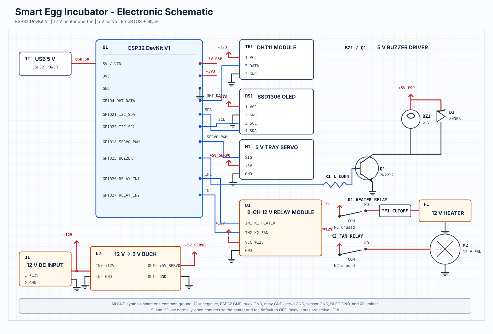

# Wiring guide

The controller-side signal connections below are taken directly from the compiled firmware. Power rails and relay load contacts remain provisional until the exact modules and load ratings are confirmed.

## Confirmed signal connections

| ESP32 | Connects to | Notes |
| --- | --- | --- |
| GPIO 4 | DHT11 `DATA` | A bare four-pin DHT11 normally needs a pull-up resistor; many three-pin modules include it |
| GPIO 18 | Servo signal | Servo power must be sized for stall current |
| GPIO 21 | OLED `SDA` | SSD1306 I2C display at address `0x3C` |
| GPIO 22 | OLED `SCL` | SSD1306 I2C clock |
| GPIO 25 | Buzzer signal | Direct drive is valid only if the buzzer current is within the GPIO limit; otherwise use a transistor |
| GPIO 26 | Relay board `IN1` / K1 | Heater channel, active-low |
| GPIO 27 | Relay board `IN2` / K2 | Humidity/fan channel, active-low |
| GND | Peripheral signal grounds | Required for non-isolated control signals |

## Power and load side

Do not treat the dashed amber paths in the diagram as final construction wiring. The finished version needs the exact:

- ESP32 board and input-power method;
- relay module model, coil voltage, opto-isolation arrangement, and contact rating;
- heater/Peltier voltage, current, and power supply;
- K2 load type and electrical rating;
- servo model and supply voltage/current;
- buzzer type and current;
- fuse and thermal-cutoff ratings.

For a DC heater, the typical safe arrangement is an external rated supply feeding a fuse, an independent thermal cutoff, the heater, and the correctly rated relay/SSR contact path in series. The ESP32 drives only the isolated control input. Exact polarity and terminal order must follow the selected driver and power supply documentation.

## Before power-up

1. Disconnect both external loads.
2. Verify the relay board powers up with K1 and K2 off.
3. Confirm GPIO 26 operates only K1 and GPIO 27 only K2.
4. Measure each supply and verify common-ground requirements.
5. Test the servo from its own rated supply.
6. Connect one load at a time through its fuse and cutoff protection.
7. Disconnect the DHT11 and confirm the heater and humidity outputs turn off and the alarm activates.
